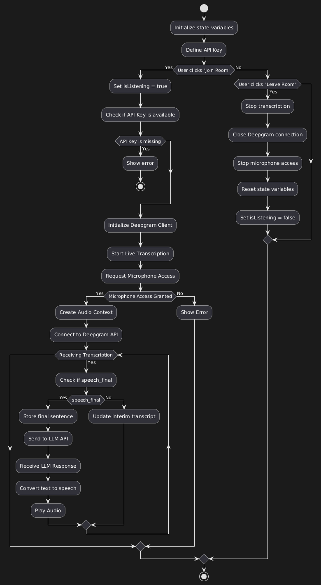

# EchoFriendly

A real-time voice assistant that enables natural, hands-free conversations with AI through speech recognition and text-to-speech capabilities.

### Live Demo: [EchoFriendly](https://echo-friendly.vercel.app)
### Video Demo: [EchoFriendly](https://drive.google.com/file/d/1S6HxoaibvvJOa4LG4HzqGGLIG96zlbw2/view?usp=sharing)

## How It Works

### Speech Input Processing
- Captures audio via the user's microphone using browser's MediaDevices API
- Streams audio in real-time to Deepgram's API for transcription
- Leverages Deepgram's nova-2 model for accurate speech-to-text conversion
- Uses voice activity detection (VAD) to identify when the user is speaking

### LLM Response Generation
- Transcribed text is sent to a Groq-powered LLM (llama-3.3-70b-versatile)
- System maintains conversation context for more coherent interactions
- LLM is instructed to provide concise, conversational responses suitable for voice interfaces

### Speech Output Processing
- AI responses are converted back to speech using Deepgram's text-to-speech API
- Audio is played through the user's device speakers
- TTS responses are designed to sound natural and conversational

### Interruption Handling
- Users can interrupt the assistant while it's speaking (barge-in capability)
- Voice activity detection immediately identifies when users begin speaking during playback
- TTS playback stops automatically when interruption is detected
- New user input is prioritized and processed immediately

## Technical Challenges & Solutions

### Challenge: Audio Stream Management
**Solution:** Custom audio processing with AudioWorklet and fallback ScriptProcessor

### Challenge: Detecting Speech During TTS Playback
**Solution:** Dual-channel audio processing that monitors microphone input even during TTS output

### Challenge: Conversation Context Management 
**Solution:** Maintain message history with LangChain's structured message format

### Challenge: Latency Minimization
**Solution:** Stream processing at all stages: speech recognition, LLM response, and TTS generation

### Challenge: Natural Conversation Flow
**Solution:** Implemention of interruption detection with VAD events and immediate response switching

#### work flow

